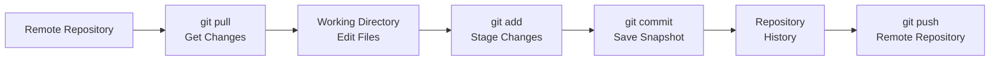
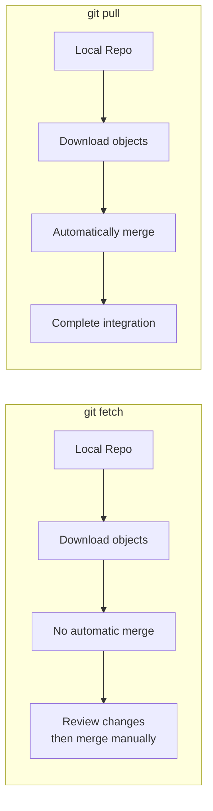
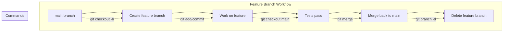

# Comprehensive Beginner's Guide to Git Version Control

## Table of Contents

1. [What is Git and Why Do You Need It?](#what-is-git-and-why-do-you-need-it)
2. [Installing Git](#installing-git)
3. [Initial Configuration](#initial-configuration)
4. [Understanding Git Concepts](#understanding-git-concepts)
5. [Creating and Initializing Repositories](#creating-and-initializing-repositories)
6. [The Core Git Workflow](#the-core-git-workflow)
7. [Working with Remote Repositories](#working-with-remote-repositories)
8. [Branching and Merging](#branching-and-merging)
9. [Viewing History and Changes](#viewing-history-and-changes)
10. [Best Practices for Commit Messages](#best-practices-for-commit-messages)
11. [Common Mistakes and How to Fix Them](#common-mistakes-and-how-to-fix-them)
12. [Quick Reference Card](#quick-reference-card)

---

## What is Git and Why Do You Need Git?

### Understanding Version Control

**Git** is a distributed version control system (VCS) that tracks changes in source code during software development. It enables multiple developers to collaborate on projects, maintaining a complete history of all modifications.

### Why Git is Essential for Software Development

Git provides several critical benefits:

| Benefit | Description |
|---------|-------------|
| **History Tracking** | Every change is recorded, allowing you to revert to any previous state |
| **Collaboration** | Multiple developers can work on the same project simultaneously |
| **Branching** | Work on features in isolation without affecting the main codebase |
| **Safety** | Never lose work—every commit is a backup point |
| **Experimentation** | Try new ideas freely with easy rollback capability |
| **Blame Tracking** | Identify who made specific changes and why |

### Git vs Other Version Control Systems

```
┌─────────────────────────────────────────────────────────────────┐
│                    Git's Distributed Model                       │
├─────────────────────────────────────────────────────────────────┤
│                                                                 │
│   Developer A          Developer B          Developer C         │
│   ┌─────────┐          ┌─────────┐          ┌─────────┐        │
│   │ Local   │◄────────►│ Local   │◄────────►│ Local   │        │
│   │ Repo    │          │ Repo    │          │ Repo    │        │
│   └────┬────┘          └────┬────┘          └────┬────┘        │
│        │                    │                    │             │
│        └────────────────────┼────────────────────┘             │
│                             │                                  │
│                             ▼                                  │
│                    ┌────────────────┐                          │
│                    │   Remote Repo  │                          │
│                    │  (GitHub/GitLab)│                         │
│                    └────────────────┘                          │
│                                                                 │
└─────────────────────────────────────────────────────────────────┘
```

Unlike centralized systems (like SVN), every developer has a complete copy of the repository history, enabling offline work and better collaboration.

---

## Installing Git

### Windows

1. Download the installer from [git-scm.com](https://git-scm.com/download/win)
2. Run the downloaded `.exe` file
3. Follow the installation wizard (default settings work well for beginners)
4. Verify installation by opening Command Prompt and typing:
   ```bash
   git --version
   ```

### macOS

**Option 1: Using Homebrew**
```bash
brew install git
```

**Option 2: Download from website**
Visit [git-scm.com/download/mac](https://git-scm.com/download/mac)

**Option 3: Built-in Git**
Git comes pre-installed on macOS. Check with:
```bash
git --version
```

### Linux (Ubuntu/Debian)

```bash
sudo apt update
sudo apt install git
```

### Verification

After installation, verify Git is working:
```bash
$ git --version
git version 2.40.0  # or your installed version
```

---

## Initial Configuration

### Setting Your Identity

Before using Git, configure your name and email—this information appears in every commit:

```bash
# Set your name
git config --global user.name "Your Name"

# Set your email (use the same email as your GitHub account)
git config --global user.email "your.email@example.com"
```

### Additional Useful Configurations

```bash
# Set default branch name
git config --global init.defaultBranch main

# Enable colored output
git config --global color.ui auto

# Set your preferred text editor
git config --global core.editor "code --wait"  # VS Code
# or
git config --global core.editor "nano"         # Nano
# or
git config --global core.editor "vim"          # Vim
```

### Viewing Your Configuration

```bash
# View all settings
git config --list

# View specific setting
git config user.name
git config user.email
```

### Configuration Levels

Git uses three configuration levels (order of precedence: local > global > system):

```bash
# System (applies to all users on the system)
git config --system

# Global (applies to all repositories for current user)
git config --global

# Local (applies to current repository only)
git config --local
```

---

## Understanding Git Concepts

### Key Terminology

| Term | Definition |
|------|------------|
| **Repository (Repo)** | A project folder containing all files and Git's tracking data |
| **Commit** | A snapshot of changes saved to the repository history |
| **Branch** | A parallel version of the codebase for independent development |
| **Remote** | A repository hosted on the internet or network (e.g., GitHub) |
| **Clone** | A copy of a remote repository on your local machine |
| **Stage (Index)** | A preparatory area where changes are collected before committing |
| **Working Directory** | Your actual project folder with files you're editing |

### The Three States

```
┌─────────────────────────────────────────────────────────────────────┐
│                        Git's Three States                            │
├─────────────────────────────────────────────────────────────────────┤
│                                                                     │
│   ┌────────────────┐                                                │
│   │  WORKING DIR   │  ← Your actual files (editable)               │
│   │   (Modified)   │                                                │
│   └────────┬───────┘                                                │
│            │                                                        │
│            │ git add                                                │
│            ▼                                                        │
│   ┌────────────────┐                                                │
│   │     STAGING    │  ← Preparation area for next commit           │
│   │    (Staged)    │                                                │
│   └────────┬───────┘                                                │
│            │                                                        │
│            │ git commit                                             │
│            ▼                                                        │
│   ┌────────────────┐                                                │
│   │   REPOSITORY   │  ← Committed snapshots                        │
│   │   (Committed)  │                                                │
│   └────────────────┘                                                │
│                                                                     │
└─────────────────────────────────────────────────────────────────────┘
```

### The Git Workflow Overview



---

## Creating and Initializing Repositories

### Initializing a New Repository

Navigate to your project folder and initialize Git:

```bash
# Navigate to your project
cd path/to/your/project

# Initialize a new Git repository
git init
```

This creates a hidden `.git` folder that contains all Git's tracking data:

```
your-project/
├── .git/           # Git's internal data (don't delete!)
├── src/
├── tests/
├── README.md
└── package.json
```

### Cloning an Existing Repository

To copy an existing repository from a remote source:

```bash
# Clone from GitHub (HTTPS)
git clone https://github.com/username/repository-name.git

# Clone to a specific folder
git clone https://github.com/username/repository-name.git my-folder

# Clone using SSH (requires SSH key setup)
git clone git@github.com:username/repository-name.git
```

### Converting an Existing Project

If you have a project without Git:

```bash
cd existing-project
git init
git add .
git commit -m "Initial commit"
```

---

## The Core Git Workflow

### Step 1: Check Status with `git status`

```bash
git status
```

**Output meanings:**

| Status | Meaning |
|--------|---------|
| `On branch main` | You're on the main branch |
| `nothing to commit` | All changes are committed |
| `Changes not staged` | Modified files not yet added |
| `Changes to be committed` | Files staged, ready to commit |
| `Untracked files` | New files not tracked by Git |

**Example output:**
```
On branch main
Changes not staged for commit:
  (use "git add <file>..." to update what will be committed)
  modified:   src/app.js
  modified:   styles.css

Untracked files:
  (use "git add <file>..." to update what will be committed)
  new-file.js
```

### Step 2: Stage Files with `git add`

Add files to the staging area:

```bash
# Add a specific file
git add filename.js

# Add multiple files
git add file1.js file2.css

# Add all changes in current directory
git add .

# Add all changes recursively
git add -A

# Add files matching a pattern
git add src/*.js     # All .js files in src/
git add *.txt        # All .txt files in current directory
```

**Staging selectively:**

```bash
# Check what changed in a file first
git diff filename.js

# Then stage just that file
git add filename.js
```

### Step 3: Commit Changes with `git commit`

Save staged changes to history:

```bash
# Commit with a message
git commit -m "Add user authentication feature"

# Commit and open editor for detailed message
git commit
```

### Complete Workflow Example

```bash
# 1. Check current status
git status

# 2. Create or edit files
# (your work here)

# 3. Stage the changes
git add src/auth.js tests/auth.test.js

# 4. Check staged changes
git status

# 5. Commit
git commit -m "Implement user login and logout functionality

- Add login form validation
- Create session management
- Add logout endpoint
- Write unit tests for auth module

Closes #42"
```

---

## Working with Remote Repositories

### Understanding Remotes

A **remote** is a repository hosted on another server (GitHub, GitLab, Bitbucket):

```
Local Repository                    Remote Repository
┌─────────────────┐                ┌─────────────────┐
│                 │    git push    │                 │
│  Local commits  │ ─────────────► │ Remote commits  │
│                 │                │                 │
│                 │    git pull    │                 │
│  Remote changes │ ◄──────────── │                 │
└─────────────────┘                └─────────────────┘
```

### Common Remote Operations

#### Adding a Remote

```bash
# Add a remote (usually named 'origin')
git remote add origin https://github.com/username/repo.git

# View all remotes
git remote -v

# Remove a remote
git remote remove origin
```

#### Renaming a Remote

```bash
# Rename origin to upstream
git remote rename origin upstream
```

#### Pushing to Remote with `git push`

```bash
# Push to main branch (first time)
git push -u origin main

# Subsequent pushes
git push

# Push a specific branch
git push origin feature-branch

# Force push (use carefully!)
git push --force
```

#### Pulling from Remote with `git pull`

```bash
# Pull and merge changes
git pull origin main

# Pull from current branch's upstream
git pull

# Fetch without merging
git fetch
```

### The Difference Between `git fetch` and `git pull`



### Cloning for the First Time

```bash
# Clone a repository
git clone https://github.com/organization/project.git

# Enter the cloned directory
cd project

# Make changes, then push
git add .
git commit -m "My first commit"
git push origin main
```

---

## Branching and Merging

### Understanding Branches

A **branch** is an independent line of development. The `main` branch is typically your production-ready code:

```
        feature-branch (isolated development)
            │
            │   * Add login
            │   *
main ──────┼────────*───*───*─── Initial commit
            │   * Add header
            │   *
            │
        feature-branch
```

### Creating and Managing Branches

```bash
# Create a new branch
git branch feature-login

# Create and switch to new branch
git checkout -b feature-login

# Switch to an existing branch
git checkout feature-login
# or (Git 2.23+)
git switch feature-login

# List all branches
git branch

# List all branches including remote
git branch -a

# Delete a branch (must not be on that branch)
git branch -d feature-login

# Force delete (if branch has unmerged changes)
git branch -D feature-login
```

### Switching Between Branches

```bash
# Switch to main branch
git checkout main
git switch main

# Switch to a specific branch
git checkout develop
git switch develop

# Create and switch in one command
git checkout -b new-feature
git switch -c new-feature
```

### Merging Branches

#### Fast-Forward Merge

When the main branch hasn't changed since the feature branch was created:

```bash
# Switch to main branch
git checkout main

# Merge feature branch
git merge feature-branch
```

#### Merge Commit

When there are changes on both branches:

```bash
# Switch to main branch
git checkout main

# Merge feature branch (creates merge commit)
git merge feature-branch
```

**Merge conflict resolution:**

```
<<<<<<< HEAD
Current change in main branch
=======
Change from feature branch
>>>>>>> feature-branch
```

To resolve:
1. Edit the file to keep the desired changes
2. Remove conflict markers
3. Stage the resolved file
4. Complete the merge commit

```bash
git add resolved-file.js
git commit -m "Resolve merge conflict"
```

### Branching Workflow



---

## Viewing History and Changes

### Viewing Commit History with `git log`

```bash
# View recent commits
git log

# View in one-line format
git log --oneline

# View with decorations (branch pointers)
git log --oneline --decorate --graph

# View last N commits
git log -5
git log --oneline -10

# View commits by author
git log --author="John"

# View commits in a date range
git log --since="2024-01-01"
git log --until="2024-12-31"

# View commits affecting a specific file
git log --oneline filename.js

# View commits with statistics
git log --stat
```

**Rich git log formats:**

```bash
# Custom format
git log --pretty=format:"%h - %an, %ar : %s"

# Graph visualization
git log --oneline --graph --all --decorate
```

### Viewing Changes with `git diff`

```bash
# View unstaged changes (working directory vs staging)
git diff

# View staged changes (staging vs last commit)
git diff --cached
git diff --staged

# View all changes (working directory vs repository)
git diff HEAD

# Compare specific files
git diff filename.js
git diff src/ tests/

# Compare branches
git diff main feature-branch

# Compare two branches for a specific file
git diff main:file.js feature-branch:file.js
```

### Using Git Show

```bash
# View a specific commit
git show abc123

# View commit with diff
git show abc123 --stat

# View the last commit
git show HEAD
```

### Visualizing the Repository

```bash
# View compact branch structure
git log --oneline --graph --all

# View all branches with commits
git branch -v
```

---

## Best Practices for Commit Messages

### Anatomy of a Good Commit Message

```
<type>(<scope>): <subject>

<body>

<footer>
```

### Example Commit Messages

**Good:**
```
feat(auth): add password reset functionality

Implement password reset flow with email verification.
- Create password reset endpoint
- Add email template
- Implement token generation

Closes #123
```

**Bad:**
```
fixed stuff
update
wip
```

### Type Prefixes

| Type | Description | Example |
|------|-------------|---------|
| `feat` | New feature | `feat(user): add social login` |
| `fix` | Bug fix | `fix(auth): resolve login timeout` |
| `docs` | Documentation | `docs: update API documentation` |
| `style` | Code style (formatting) | `style: format with prettier` |
| `refactor` | Code restructuring | `refactor: simplify validation` |
| `test` | Adding tests | `test: add auth unit tests` |
| `chore` | Maintenance | `chore: update dependencies` |

### Writing Effective Commit Messages

**Do:**
- Use imperative mood ("Add feature" not "Added feature")
- Be concise but descriptive (50 characters or less for subject)
- Explain the "why" in the body
- Reference issue numbers
- Keep related changes together

**Don't:**
- Use vague messages
- Include sensitive information
- Mix unrelated changes
- Write messages in a foreign language

### Commit Message Template

Create a `.gitmessage` file:

```
# Type: feat, fix, docs, style, refactor, test, chore
# 
# <subject line - 50 characters max>
#
# Explain why this change is being made and what was changed.
# Wrap body at 72 characters.
#
# Issues: Closes #123, Fixes #456
```

Set it as default:
```bash
git config --global commit.template ~/.gitmessage
```

---

## Common Mistakes and How to Fix Them

### Mistake 1: Committing to the Wrong Branch

**Solution:**
```bash
# If you just committed
git reset --soft HEAD~1    # Undo commit, keep changes staged
git checkout correct-branch
git commit -m "Your message"

# If you need to move commits to another branch
git log --oneline          # Note the commit hash
git checkout correct-branch
git cherry-pick <commit-hash>
```

### Mistake 2: Committing Sensitive Information

**Before pushing:**
```bash
# Remove from commit but keep in working directory
git reset --soft HEAD~1
# Remove file from staging
git rm --cached sensitive-file.txt
# Delete from working directory
rm sensitive-file.txt
```

**After pushing (use BFG or git filter-repo):**
```bash
# Install BFG
brew install bfg

# Remove sensitive data
bfg --delete-files sensitive-file.txt

# Clean up
git reflog expire --expire=now --all && git gc --prune=now -- aggressive

# Force push (careful!)
git push --force
```

### Mistake 3: Wrong Commit Message

**Before pushing:**
```bash
git commit --amend -m "Corrected message"
```

**After pushing:**
```bash
git commit --amend -m "Corrected message"
git push --force
```

### Mistake 4: Accidentally Staging Files

```bash
# Unstage a specific file
git reset filename.js

# Unstage all files
git reset

# Unstage and keep changes in working directory
git reset HEAD
```

### Mistake 5: Deleting Uncommitted Changes

**If changes were staged:**
```bash
git reflog              # Find the commit before reset
git checkout <commit-hash> -- filename.js
```

**If changes were not staged (use git reflog):**
```bash
git reflog
git checkout <recovery-hash> -- .
```

### Mistake 6: Merge Conflicts

**Steps to resolve:**

1. Don't panic! The files aren't lost.
2. Open the conflicted file and look for:
   ```<<<<<<< HEAD
   Your current change
   =======
   Incoming change from other branch
   >>>>>>> branch-name
   ```
3. Decide which changes to keep (or combine them)
4. Remove the conflict markers
5. Stage the resolved file
6. Complete the merge

```bash
git add resolved-file.js
git commit -m "Resolve merge conflict"
```

### Mistake 7: Forgot to Add a File

```bash
# Stage the missing file and amend the commit
git add forgotten-file.js
git commit --amend --no-edit
```

### Mistake 8: Wrong Branch Name

**Rename before first push:**
```bash
git branch -m old-name new-name
```

**After push:**
```bash
# Delete old remote branch
git push origin --delete old-name

# Push new branch
git push origin new-name

# Set upstream
git branch --set-upstream-to=origin/new-name
```

---

## Quick Reference Card

### Essential Commands Summary

| Command | Description |
|---------|-------------|
| `git init` | Initialize a new repository |
| `git clone <url>` | Clone an existing repository |
| `git status` | Show working directory status |
| `git add <file>` | Stage a file for commit |
| `git add .` | Stage all changes |
| `git commit -m "msg"` | Commit staged changes |
| `git push` | Push to remote repository |
| `git pull` | Pull and merge from remote |
| `git branch` | List all branches |
| `git branch <name>` | Create a new branch |
| `git checkout <branch>` | Switch to a branch |
| `git merge <branch>` | Merge a branch |
| `git log` | View commit history |
| `git diff` | View unstaged changes |
| `git diff --cached` | View staged changes |

### Daily Workflow Checklist

```bash
# Start of day
git checkout main
git pull origin main
git checkout -b feature-branch

# During development
git add .
git commit -m "Descriptive message"
# Repeat as needed

# End of day
git push -u origin feature-branch
```

---

## Next Steps

Now that you understand Git fundamentals, continue learning:

1. **Interactive Staging**: `git add -p` for partial staging
2. **Stashing**: `git stash` for temporary storage
3. **Rebasing**: `git rebase` for cleaner history
4. **Alias Configuration**: Create custom shortcuts
5. **Git GUI Tools**: GitKraken, Sourcetree, or VS Code
6. **GitHub/GitLab Features**: Pull requests, code reviews

### Recommended Learning Resources

- Official Git Documentation: [git-scm.com/doc](https://git-scm.com/doc)
- Interactive Git Learning: [learngitbranching.js.org](https://learngitbranching.js.org)
- GitHub Skills: [skills.github.com](https://skills.github.com)

---

## Conclusion

This guide provides a foundation for using Git effectively. Practice these commands regularly, and version control will become second nature. Remember: Git is designed to help you, not complicate your work. When in doubt, commit early and often!

---

*Last Updated: February 2024*
